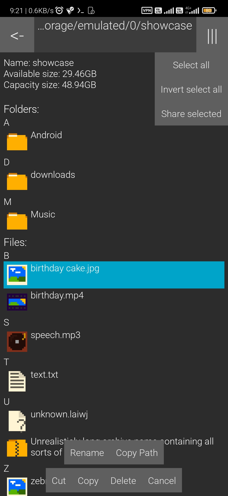

# Little File Explorer

## Descriptions

A small, simple file explorer, designed with compatibility in mind.

Open-sourced and publicly-viewable code for anyone worrying about being locked in or privacy invasion.

It provides multiple functions, including copy and pasting files, multi-file share, etc. More information available in **Features** section below.

Supports Android 1.0+

Currently under 40 KB.

Previous known as *Simple File Explorer* (but from martinmimigames).

Location of website:
[https://martinmimigames.github.io/projects/little-file-explorer](https://martinmimigames.github.io/projects/little-file-explorer/index.html).

## Screenshots

## Features

- Free
- Small (< 40 KB)
- Basic file operations (Cut, copy, paste, rename, delete)
- File name filter
- Name and Modified Time sort
- Easy switch between sdcard and internal storage
- Multi-share function
- File/folder path copying
- Minimum permissions

## Latest Versions

- v4.11
  - Fix crashing if last exited on a non-existing folder
  - Fix unable to exit folders with access denied
  - Added details page for files
  - Added light mode (follows system settings)
  - Added sorting by file size
  - Moved storage info to the bottom
  - Added slight padding to dialogs

- v4.10
  - Added "toggle hidden" option (available in menu button)
  - Added File/Folder name filtering (available on top bar)
  - Added display sorting (name, last modified time) (available in menu button)
  - Added file path remembering on app exit
  - Re-added share button in open list options
  - Fixed delete confirmation screen being full screen

- v4.9
  - Fixed sticky selection state after leaving app
  - Fixed concurrent directory list modification
  - Removed share button from file option menu
  - Added duplicate folder warning when creating new folder
  - Changed rounding system for storage size display
  - Always update storage list quick switch display
  - Now use cache thread pool for reducing idle cpu usage and increase performance

- v4.8
  - Allow folder path to be copied to clipboard
  - Fixed incorrect handling after path copying
  - Fixed delete conformation button being pushed out by long list
  - Fixed copying to incorrect directory when moved directory while in progress

- v4.7
  - Added multi-share option (sdk 4+)
  - Added file path copy option
  - Allow open file with default apps
  - Reduced open list button size
  - Capitalised buttons
  - Changed opener text

- v4.6
  - Fixed not opening when no sdcard inserted

- v4.5
  - smaller apk
  - fixed quick selection overlap with menu list
  - opening file request by other app now have open prompt
  - changed audio png
  - back button now go back to parent folder if available

## Branches

- main: latest source-code

## Issues

Issues and pull requests are always welcome!

You can submit issues the following ways:

- via [Github Issues](https://github.com/martinmimigames/little-file-explorer/issues)
- via email: <martinmimigames@gmail.com>

## Installation

[Get it from the official website](https://martinmimigames.github.io/projects/little-file-explorer)

## Made by Martinmimigames

Official Website at [https://martinmimigames.github.io](https://martinmimigames.github.io)

### Last update of README

Date : 10-07-2023 dd-mm-yyyy

### Important

**Please read the license!**
